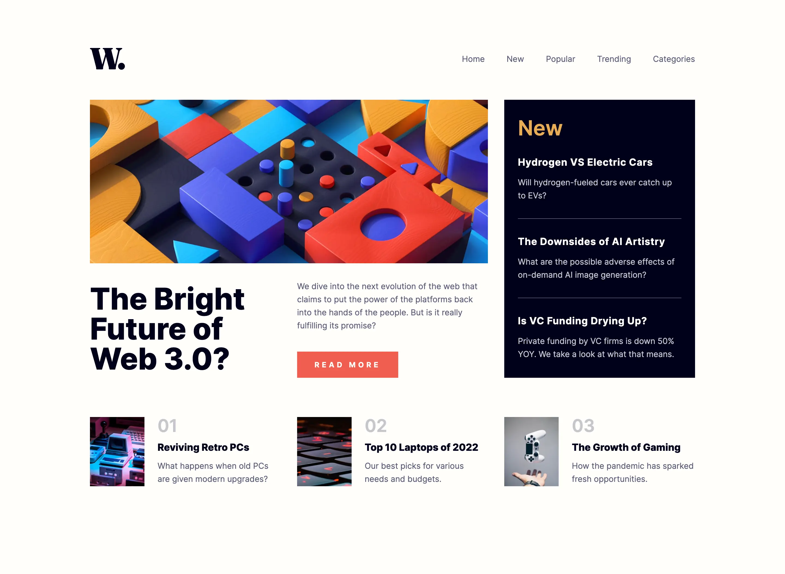
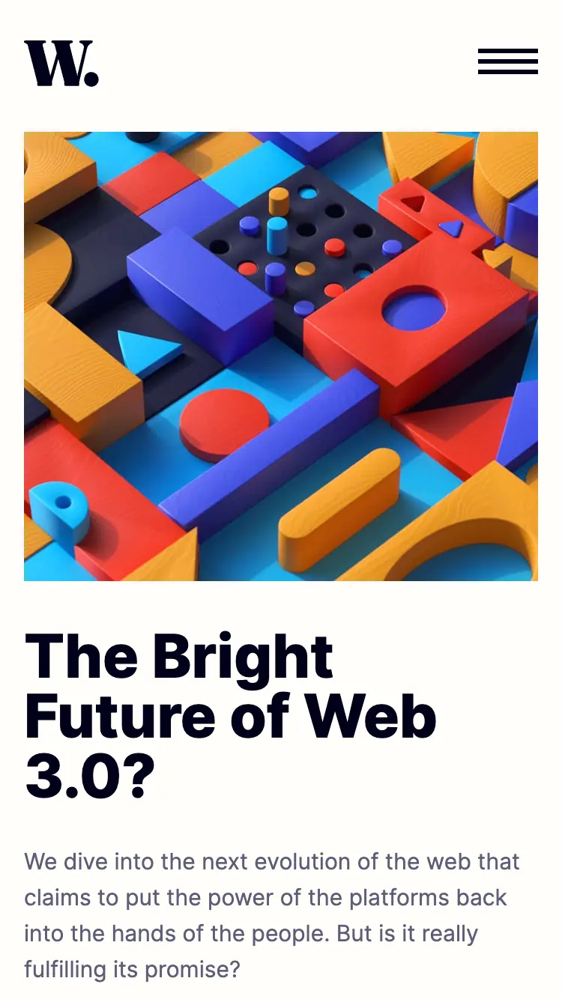

# Frontend Mentor - News homepage solution

This is a solution to the [News homepage challenge on Frontend Mentor](https://www.frontendmentor.io/challenges/news-homepage-H6SWTa1MFl). Frontend Mentor challenges help you improve your coding skills by building realistic projects.

### Screenshot




### Links

- Live Site URL: https://stautuan.github.io/new-homepage/

## My process

### Built with

- Semantic HTML5 markup
- CSS custom properties
- Flexbox
- CSS Grid

### What I learned

This project was a practice to apply my latest learnings for the first time, such as developing a mobile navigation menu, employing sass and css properties, utilizing rem units for scalability, and bem naming convention. It wasn't perfect but I had a lot fun making it, and I'm very happy that I was able to produce this result while utilizing these new technologies.

With that being said, I couldn't have done all of this without Google. There was a ton of Googling involved completing this challenge, and I'm proud to say that most of my searches were a success.

The goal was to apply what I've learned but I ended up learning a lot along the way:

This code will help you scroll the content while the mobile nav remains open and sticky on the side:

```css
.overlay {
  position: fixed;
  top: 0;
  overflow-y: scroll;
}
```

This might not be the most optimal code, but I'm proud of this 😄

```js
const closeNav = () => {
  headerEl.classList.remove("nav-open");
  overlay.classList.add("hidden");
};

window.addEventListener("resize", closeNav);

navLinks.forEach((navLink) => {
  navLink.addEventListener("click", () => {
    if (headerEl.classList.contains("nav-open")) {
      closeNav();
    }
  });
});
```

But most importantly, I learned how to take a step back when hitting a wall. It turns out that a good night's sleep paves the way to the solution. 🤣

### Continued development

Sass, css properties and grid, bem, and javascript.

## Author

- Frontend Mentor - @stautuan
